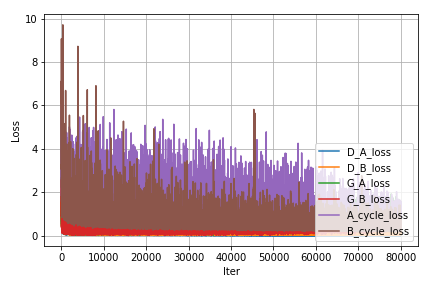

# Cycle-GANs

This is repo for Cycle-GANs image-to-image translation by MLYZ team.

## Prerequisites
- Python 3.3 or above
- [Pytorch 0.4.0](torch.org)

For UCSD `DSMLP` developer, you don't need to install anything.

## Quick Start

`python3 CycleGAN_main.py --dataset [dataset_name]`

`CycleGAN_main.py` invokes `network.py` to generate generator and discriminator. During the training process, the main function will invoke `train.py` and `test.py` to translate training pictures and test pictures in dataset folders. `utils.py` contains some necessary auxiliary functions.

## Dataset

You can download datasets manually: https://people.eecs.berkeley.edu/~taesung_park/CycleGAN/datasets/

Downloadable datasets: apple2orange, summer2winter_yosemite, horse2zebra, monet2photo, cezanne2photo, ukiyoe2photo, vangogh2photo, maps, cityscapes, facades, iphone2dslr_flower, ae_photos

Or you can run shell script to download dataset automatically via below command:

`./download_dataset <dataset_name>`

The dataset before using CycleGAN should be organized as following structure:

```
.
├── data                   
|   ├── <dataset_name>         # Like facades
|   |   ├── trainA             # Trainset A
|   |   ├── trainB             # Trainset B
|   |   ├── testA              # Testset A
|   |   ├── testB              # Testset B
```

## Results

The corresponding result is saved in `<dataset_name>_results`.

The result directory is organized as following structure:

```
.
├── <dataset_name>_results   # Dataset name like facades              
|   ├── test_results         # test_results
|   |   ├── AtoB             # A transfers to B
|   |   ├── BtoA             # B transfers to A
|   ├── train_results        # train_results
|   |   ├── AtoB             # A transfers to B
|   |   ├── BtoA             # B transfers to A
```

## Training details



## Demo

Please visit the demo website to see more results!

**[Demo Website](https://sites.google.com/view/ece285-styletransfer/%E9%A6%96%E9%A1%B5?authuser=1)**

## Code Organization

```
demo.ipynb                --   Run a demo of our code
CycleGAN_main.py          --   Main function
network.py                --   Definition of our networks
train.py                  --   Definition of training function 
test.py                   --   Definition of test function
utils.py                  --   Definition of necessary auxiliary functions.
download_dataset.sh       --   Dataset automatic download shell script
data folder               --   Dataset location
[dataset\_name]\_results  --   Results
```

## Reference

[1] P. Jun-Yan, Taesung and Alexei, “Unpaired image-to-image translation using cycle-consistent
adversarial networks,” 2018
